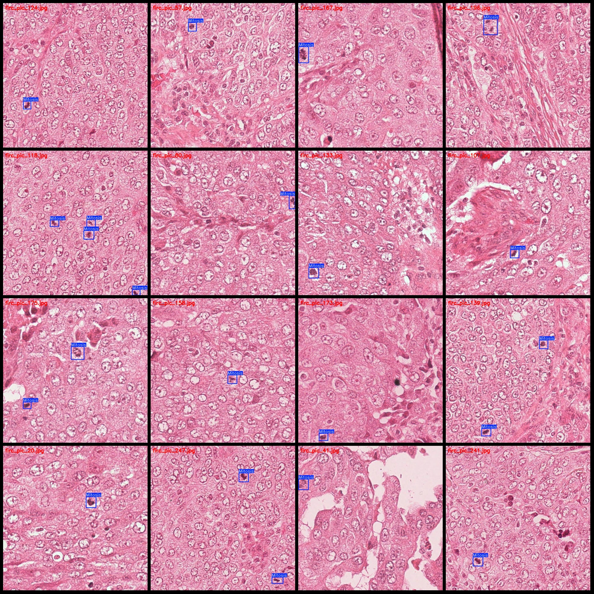
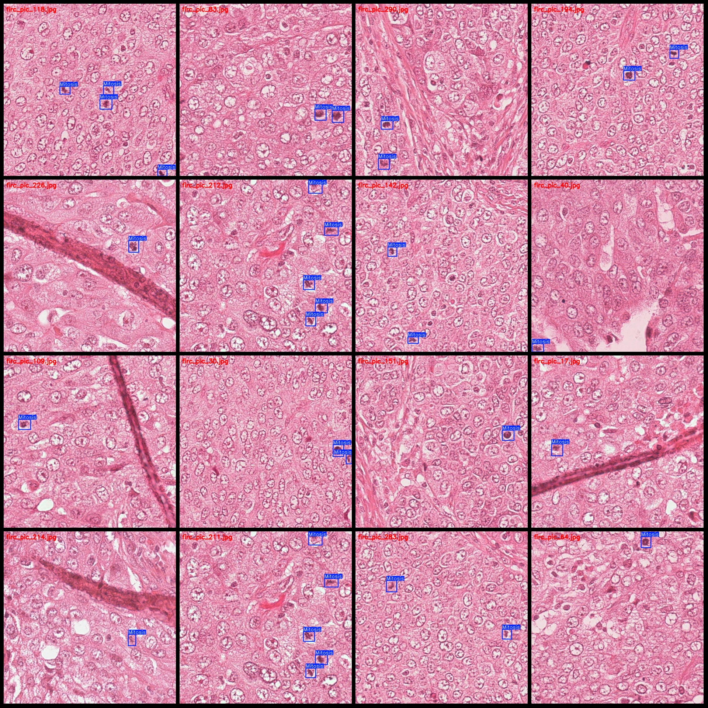

# Cellular Mitosis Detection Dataset: VOC+YOLO Format with 304 Images in 1 Category

The dataset format follows Pascal VOC and YOLO specifications, without including split paths in the txt file. It only contains jpeg images along with their corresponding VOC XML files and YOLO txt 
files. 

Number of images (jpg file count): 304
Number of annotations (xml file count): 304
Number of annotations (txt file count): 304
Number of categories: 1
Annotation category name: ["Mitosis"]
Number of bounding boxes per category: 436
Total number of bounding boxes: 436
Number of images per category: 304
Image resolution: 688x688
Annotation tool used: labelImg
Annotation rules: Drawing bounding boxes for each category
Important note: The dataset does not contain training/validation/test splits; you need to manually divide it.
Special declaration: This dataset does not guarantee the accuracy of the models or weight files trained on this dataset.

Image previews are not provided as they are part of the dataset itself.

## Image

Here is a pay link on Stripe ( https://buy.stripe.com/3cs8yP7sY87d0vu9AB ). Please contact me lonlonago@foxmail.com after funding $89, and I will send you a complete data files , thank you!

